# Health.md Visualizations

An [Obsidian](https://obsidian.md) plugin that renders rich Apple Health visualizations from data files in your vault. Drop a fenced code block into any note (including a daily note) and the plugin renders an interactive canvas chart pulled from your local health data.

Supported data formats: **JSON**, **CSV**, **Markdown frontmatter**, and **Obsidian Bases** (YAML frontmatter).

Download [Health.md](https://apps.apple.com/us/app/health-md/id6757763969) on the app store to easily export and get access to your Apple Health data.

## Installation

Install Health.md from the Obsidian Community Plugins directory:

[https://community.obsidian.md/plugins/health-md](https://community.obsidian.md/plugins/health-md)

### Manual

If you prefer to install manually:

1. Download `main.js`, `manifest.json`, and `styles.css` from the [latest release](https://github.com/CodyBontecou/health-md-visualizations/releases).
2. Copy them into `<your vault>/.obsidian/plugins/health-md/`.
3. Reload Obsidian and enable **Health.md Visualizations** in **Settings → Community plugins**.

### From source

```bash
git clone https://github.com/CodyBontecou/health-md-visualizations.git
cd health-md-visualizations
npm install
npm run build
```

Then copy `main.js`, `manifest.json`, and `styles.css` into your vault's plugin folder.

## Quick start

1. Put your Apple Health export files in a folder inside your vault — by default the plugin looks at `Health/`.
2. In any note, add a fenced code block:

   ````markdown
   ```health-viz
   type: heart-terrain
   ```
   ````

3. Switch to reading view (or live preview) and the chart renders.

You can also run the **Insert health visualization** command from the command palette to open an insertion wizard. Pick a visualization category and type, then fill in the date range, renderer-specific options, and optional size before the plugin inserts the `health-viz` block at the cursor.

## Settings

Open **Settings → Health.md Visualizations**:

| Setting | Description |
| --- | --- |
| **Data folder** | Path inside the vault where the plugin looks for health files. Default `Health`. Includes folder autocomplete in settings to reduce path typos. |
| **Data folder structure** | Opt-in folder nesting. Default `Flat` keeps the historical behavior of loading files directly under the data folder. `Year`, `Month`, `Week`, and `Day` scan up to those subfolder depths for layouts like `Health/2026/`, `Health/2026/06/`, `Health/2026/W23/`, or `Health/2026/06/03/`. Choose `Custom template` to scan folders using your own pattern. |
| **Custom folder path template** | Used when structure is `Custom template`. Supports predefined variables `{year}`, `{month}`, `{week}` (for example `W23`), `{day}`, and `{date}` plus static folder names. Example: `{year}/{month}/{day}`. |
| **File pattern** | Glob to filter which files in that folder are loaded. Examples: `*` (all supported), `*.json`, `2026-*.md`, `health-*.csv`, `2026/**/*.json` for nested paths. |
| **Data format** | `auto` (detect by file extension), `json`, `csv`, `markdown`, or `bases`. Markdown support requires YAML frontmatter (Bases-style). |
| **Theme** | `auto` matches the active Obsidian theme (including custom CSS colors), or force `dark` / `light`. |
| **Color scheme** | Pick a built-in palette, choose `Match Obsidian theme` to use the theme accent, or set individual custom colors. |
| **Default width** | Default canvas width in pixels (charts shrink to container width). |
| **Default height** | Default canvas height in pixels. |
| **Data point click action** | What clicking a hoverable canvas point does: pin the tooltip, open the source health data file, or open the matching Daily Note. |

Nested folders are opt-in so existing vaults keep working unchanged. In any nested mode, including custom templates, files directly under the data folder are still loaded, which lets you migrate from flat exports gradually.

The plugin watches your data folder and automatically refreshes its cache when files are added, modified, or deleted.

### Visualization appearance

Global appearance is controlled from settings, and each `health-viz` block can override it when a specific chart needs its own style:

```health-viz
type: bar-chart
metric: steps
colorScheme: theme
accent: #7c3aed
background: #111827
foreground: #f9fafb
muted: #9ca3af
```

Supported appearance keys are `theme` (`auto`, `dark`, `light`), `colorScheme`/`palette` (`theme`, `default`, `ocean`, `forest`, `sunset`, `aurora`, `monochrome`), `background`/`bg`, `foreground`/`fg`, `muted`, `accent`, `secondary`, `heart`, `sleepDeep`, `sleepRem`, `sleepCore`, and `sleepAwake`.

### Health.md schema compatibility

The plugin supports legacy/unversioned Health.md daily exports as schema `v0`, the first public versioned `healthmd.health_data` schema (`schema_version: 1`), and schema v2 medication fields (`medication_count`, `medication_details`, `medication_dose_events`, and related dose counts). Newer daily schemas are parsed best-effort and surfaced in the settings compatibility summary so you know when to update the plugin.

Health.md roll-up files (`schema: healthmd.rollup_summary`, `schema_version: 1`, or files under `Health/Rollups/`) are indexed separately from daily records so weekly/monthly/yearly summaries do not pollute day-level charts. The plugin also reads `_healthmd_data_dictionary.json` when present so custom frontmatter field names can be mapped back to stable canonical keys and units.

If charts look incomplete after changing Health.md export settings, open **Settings → Health.md Visualizations → Health.md schema compatibility** and click **Scan now**. For the cleanest historical charts, update the plugin before enabling roll-ups or format folders in Health.md, then re-export older date ranges if you want all historical files to use the same canonical units.

## Visualization types

Specify one of these as the `type:` field in your code block. The gallery below shows each renderer with a short description; start at `examples/visualization-reference.md` for the category-specific argument tables, defaults, and copy/paste examples.

<table>
<tr>
<td width="46%"><a href="examples/images/visualizations/intro-stats.png">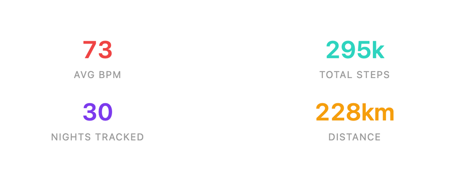</a></td>
<td width="54%"><p><strong><code>intro-stats</code></strong></p><p>HTML summary card — totals, averages, and highlights for the selected dataset.</p><p><strong>Extra arguments:</strong> none.</p></td>
</tr>
<tr>
<td><a href="examples/images/visualizations/summary-card.png">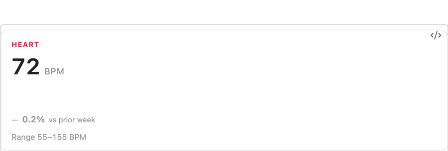</a></td>
<td><p><strong><code>summary-card</code></strong></p><p>Apple-style headline card with large KPI, sparkline, range, and comparison delta.</p><p><strong>Extra arguments:</strong> <code>metric</code>, <code>compareWindow</code>.</p></td>
</tr>
<tr>
<td><a href="examples/images/visualizations/trend-tile.png">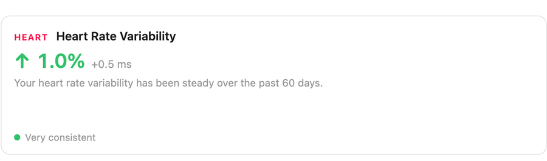</a></td>
<td><p><strong><code>trend-tile</code></strong></p><p>Apple Health Trends-style HTML card with direction arrow, percent delta, narrative, and two-period sparkline.</p><p><strong>Extra arguments:</strong> <code>metric</code>, <code>currentWindow</code>, <code>priorWindow</code>.</p></td>
</tr>
<tr>
<td><a href="examples/images/visualizations/activity-rings.png">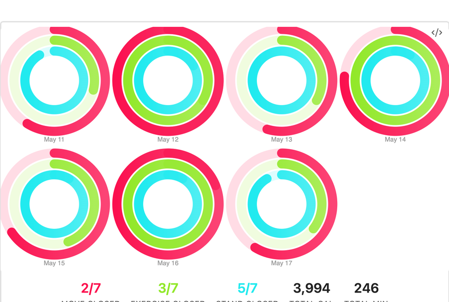</a></td>
<td><p><strong><code>activity-rings</code></strong></p><p>Apple's Move / Exercise / Stand rings; single-day large ring set or multi-day small multiples.</p><p><strong>Extra arguments:</strong> <code>moveGoal</code>, <code>exerciseGoal</code>, <code>standGoal</code>.</p></td>
</tr>
<tr>
<td><a href="examples/images/visualizations/vitals-rings.png">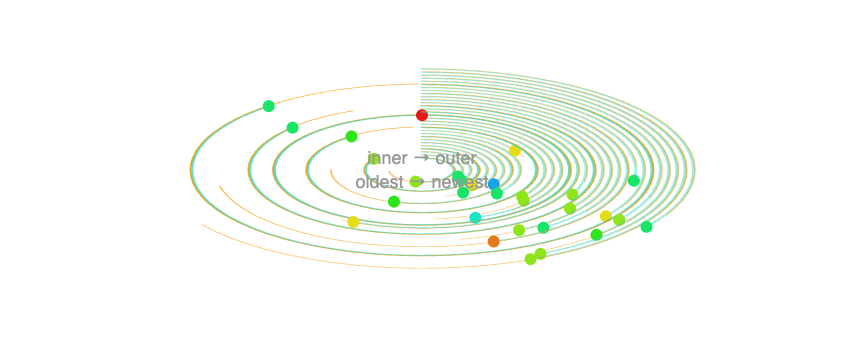</a></td>
<td><p><strong><code>vitals-rings</code></strong></p><p>Health.md radial activity/vitals rings: steps, calories, and heart-rate context per day.</p><p><strong>Extra arguments:</strong> none.</p></td>
</tr>
<tr>
<td><a href="examples/images/visualizations/bar-chart.png">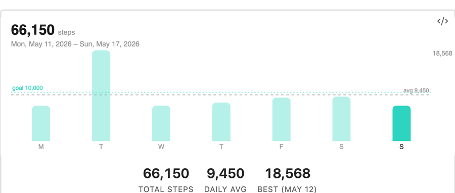</a></td>
<td><p><strong><code>bar-chart</code></strong></p><p>Apple-style vertical bars with latest day highlight, optional goal line, and optional average line.</p><p><strong>Extra arguments:</strong> <code>metric</code>, <code>goal</code>, <code>showAverage</code>.</p></td>
</tr>
<tr>
<td><a href="examples/images/visualizations/activity-heatmap.png">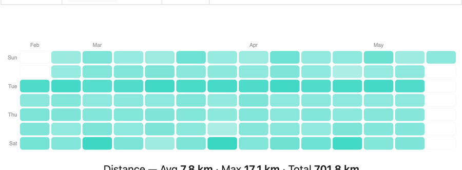</a></td>
<td><p><strong><code>activity-heatmap</code></strong></p><p>GitHub-style activity calendar shaded by daily steps, calories, or distance.</p><p><strong>Extra arguments:</strong> <code>metric</code>.</p></td>
</tr>
<tr>
<td><a href="examples/images/visualizations/step-spiral.png">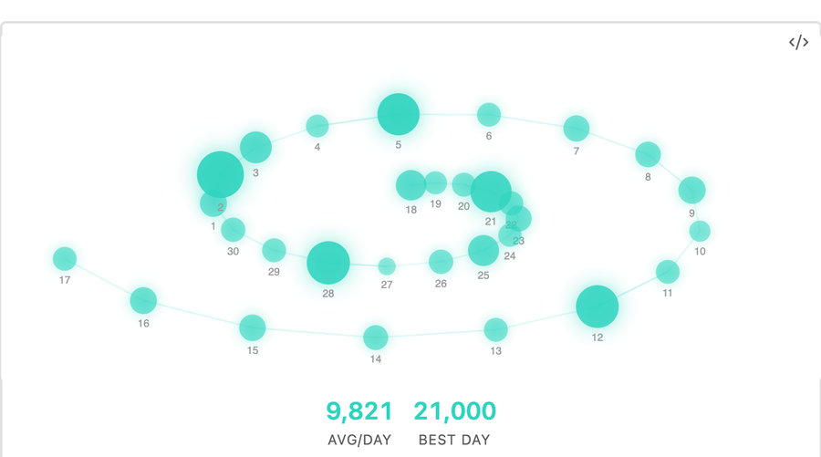</a></td>
<td><p><strong><code>step-spiral</code></strong></p><p>Daily step counts arranged on a spiral, with older days near the center and newer days spiraling outward.</p><p><strong>Extra arguments:</strong> none.</p></td>
</tr>
<tr>
<td><a href="examples/images/visualizations/weekday-average.png">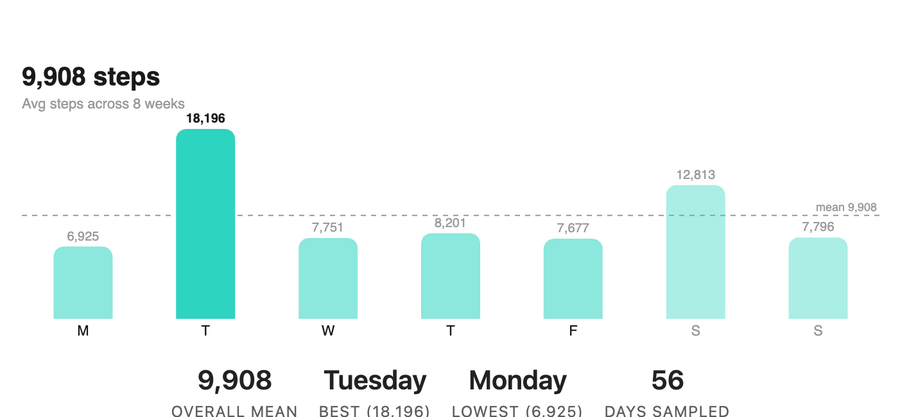</a></td>
<td><p><strong><code>weekday-average</code></strong></p><p>Seven bars showing a metric's average by weekday with an overall-mean line.</p><p><strong>Extra arguments:</strong> <code>metric</code>, <code>weekStart</code>.</p></td>
</tr>
<tr>
<td><a href="examples/images/visualizations/heart-terrain.png">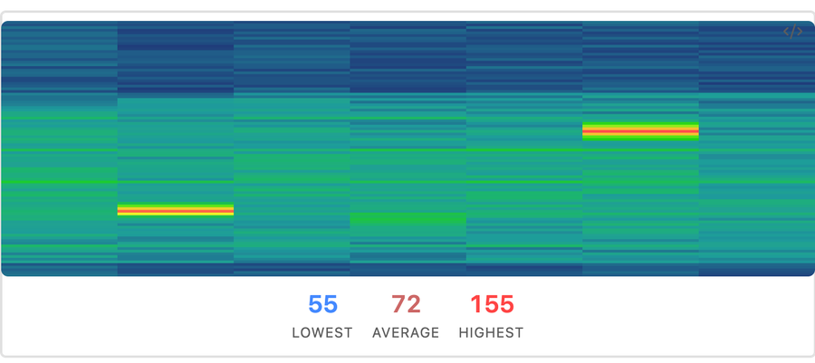</a></td>
<td><p><strong><code>heart-terrain</code></strong></p><p>Heart-rate samples plotted as daily terrain / ridgeline rows over time.</p><p><strong>Extra arguments:</strong> none.</p></td>
</tr>
<tr>
<td><a href="examples/images/visualizations/heart-range.png">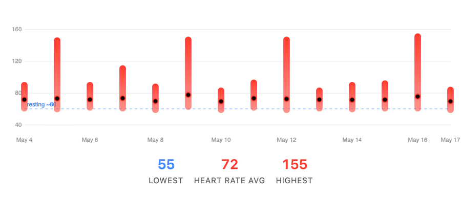</a></td>
<td><p><strong><code>heart-range</code></strong></p><p>Per-day min-to-max heart-rate capsule with an average dot and optional resting-HR reference line.</p><p><strong>Extra arguments:</strong> <code>metric</code>.</p></td>
</tr>
<tr>
<td><a href="examples/images/visualizations/hrv-trend.png">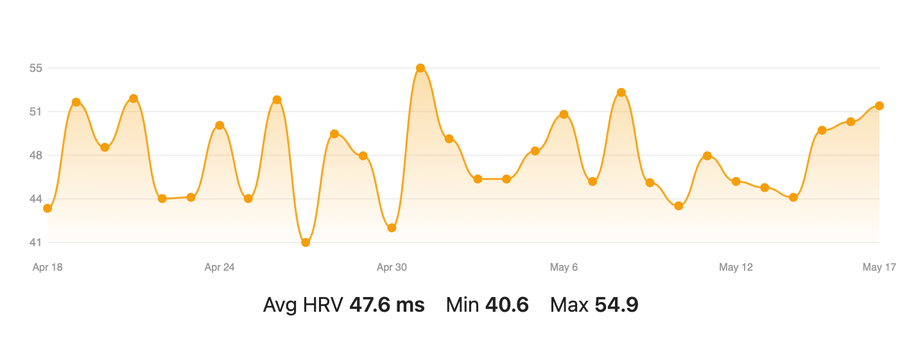</a></td>
<td><p><strong><code>hrv-trend</code></strong></p><p>HRV trend line from daily HRV or HRV samples.</p><p><strong>Extra arguments:</strong> none.</p></td>
</tr>
<tr>
<td><a href="examples/images/visualizations/oxygen-river.png">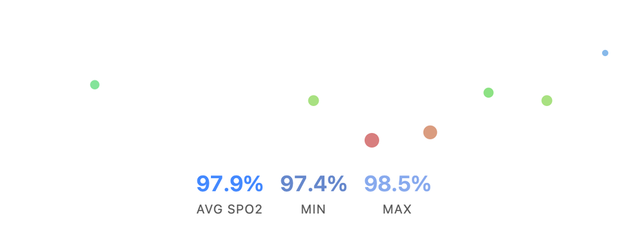</a></td>
<td><p><strong><code>oxygen-river</code></strong></p><p>Blood oxygen samples as a flowing band with summary stats.</p><p><strong>Extra arguments:</strong> none.</p></td>
</tr>
<tr>
<td><a href="examples/images/visualizations/oxygen-range.png">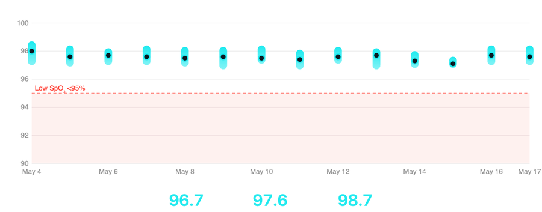</a></td>
<td><p><strong><code>oxygen-range</code></strong></p><p>Daily SpO₂ or respiratory min/max capsule with warning-zone shading.</p><p><strong>Extra arguments:</strong> <code>metric</code>.</p></td>
</tr>
<tr>
<td><a href="examples/images/visualizations/breathing-wave.png">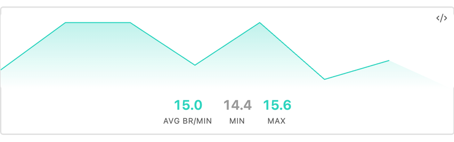</a></td>
<td><p><strong><code>breathing-wave</code></strong></p><p>Respiratory-rate samples as a wave.</p><p><strong>Extra arguments:</strong> none.</p></td>
</tr>
<tr>
<td><a href="examples/images/visualizations/sleep-schedule.png">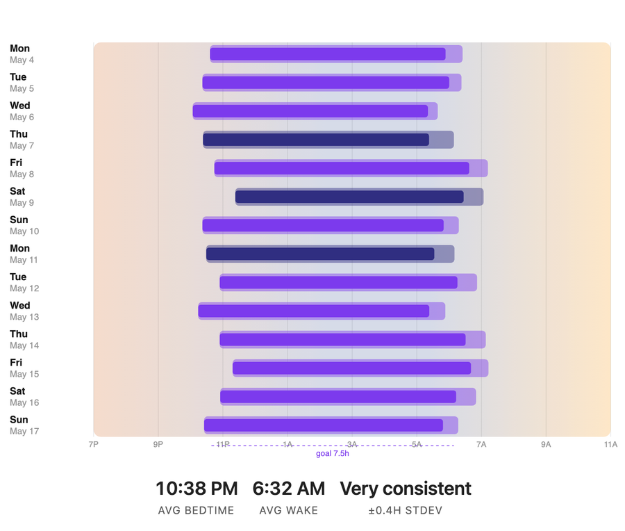</a></td>
<td><p><strong><code>sleep-schedule</code></strong></p><p>Horizontal bedtime-to-wake bars against a sunset→night→sunrise backdrop. Requires bedtime/wake timing or stage timestamps; 24-hour and 12-hour times are supported.</p><p><strong>Extra arguments:</strong> <code>sleepGoal</code>, <code>windowStart</code>, <code>windowEnd</code>.</p></td>
</tr>
<tr>
<td><a href="examples/images/visualizations/sleep-quality-bars.png">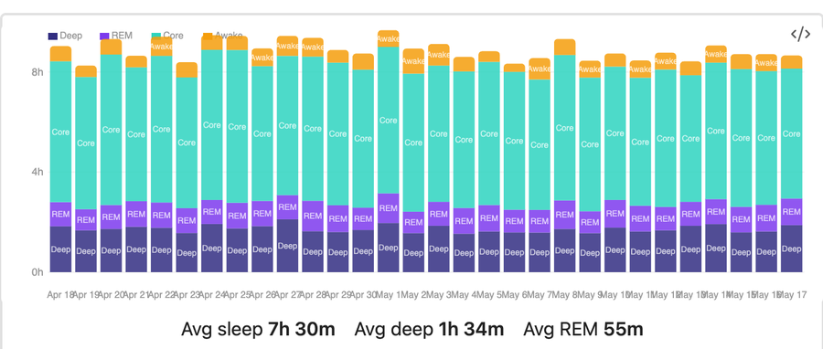</a></td>
<td><p><strong><code>sleep-quality-bars</code></strong></p><p>Stacked nightly bars for deep, core, REM, and awake time.</p><p><strong>Extra arguments:</strong> none.</p></td>
</tr>
<tr>
<td><a href="examples/images/visualizations/sleep-architecture.png">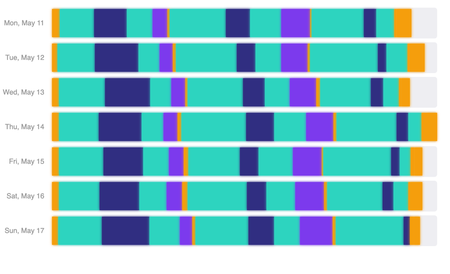</a></td>
<td><p><strong><code>sleep-architecture</code></strong></p><p>Linear timeline of sleep stages with depth bands.</p><p><strong>Extra arguments:</strong> none.</p></td>
</tr>
<tr>
<td><a href="examples/images/visualizations/sleep-polar.png">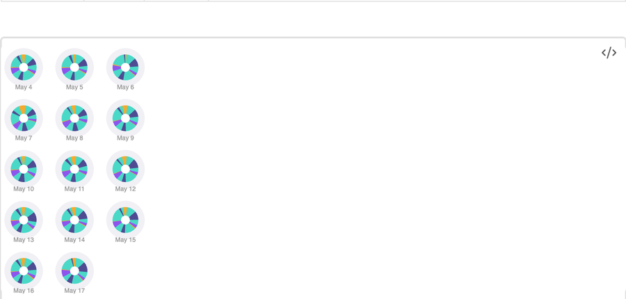</a></td>
<td><p><strong><code>sleep-polar</code></strong></p><p>Polar clock view of sleep stages per night.</p><p><strong>Extra arguments:</strong> none.</p></td>
</tr>
<tr>
<td><em>Screenshot coming soon.</em></td>
<td><p><strong><code>mood-trend</code></strong> and mood insights</p><p>State of Mind / mood valence over time plus calendar, sleep scatter, day timeline, association breakdown, label cloud, volatility, kind split, circadian clock, recovery tile, and association matrix views.</p><p><strong>Extra arguments:</strong> <code>showContext</code>, <code>limit</code>, <code>maxDays</code>, <code>metric</code> depending on chart.</p></td>
</tr>
<tr>
<td><em>Screenshot coming soon.</em></td>
<td><p><strong><code>medication-overview</code></strong> (aliases: <code>medications</code>, <code>medication-adherence</code>)</p><p>Schema v2 medication inventory, taken/skipped adherence summary, per-medication breakdown, trend, and recent dose-event table. Each section is also available as <code>medication-inventory</code>, <code>medication-adherence-summary</code>, <code>medication-dose-status</code>, <code>medication-adherence-trend</code>, and <code>medication-recent-dose-events</code>.</p><p><strong>Extra arguments:</strong> <code>trend</code>, <code>limit</code>.</p></td>
</tr>
<tr>
<td><a href="examples/images/visualizations/walking-symmetry.png">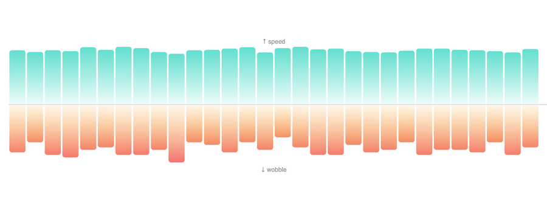</a></td>
<td><p><strong><code>walking-symmetry</code></strong></p><p>Walking speed and asymmetry / gait metrics.</p><p><strong>Extra arguments:</strong> none.</p></td>
</tr>
<tr>
<td><a href="examples/images/visualizations/workout-log.png">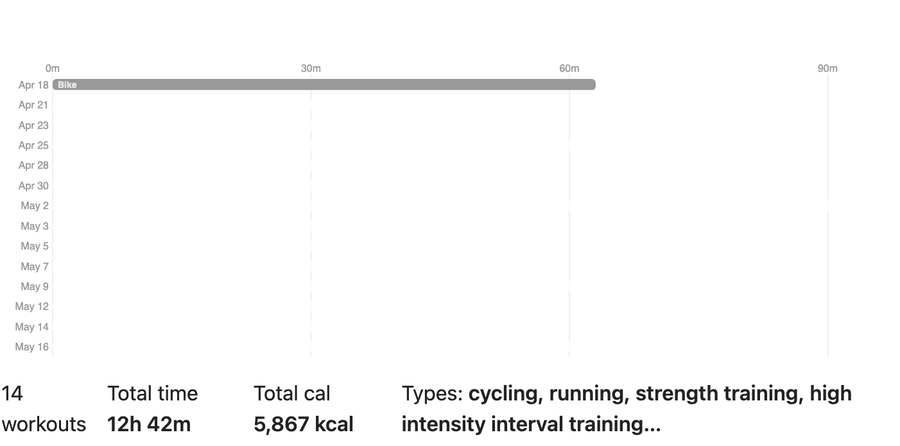</a></td>
<td><p><strong><code>workout-log</code></strong></p><p>Workout timeline with duration bars and workout-type colors.</p><p><strong>Extra arguments:</strong> none.</p></td>
</tr>
<tr>
<td><a href="examples/images/visualizations/workout-heart-rate.png">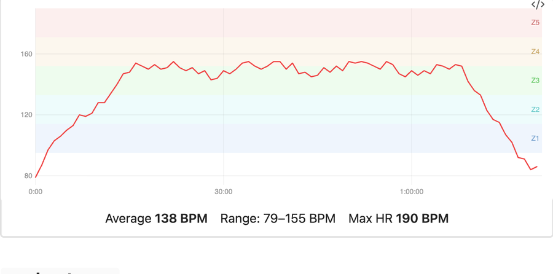</a></td>
<td><p><strong><code>workout-heart-rate</code></strong></p><p>Heart-rate time series and optional zone bands for one workout. Falls back to detailed Health.md zone exports, daily samples in the workout window, then a min/avg/max summary chart.</p><p><strong>Extra arguments:</strong> <code>date</code>, <code>workout</code>, <code>maxHeartRate</code>.</p></td>
</tr>
<tr>
<td><a href="examples/images/visualizations/workout-map.png">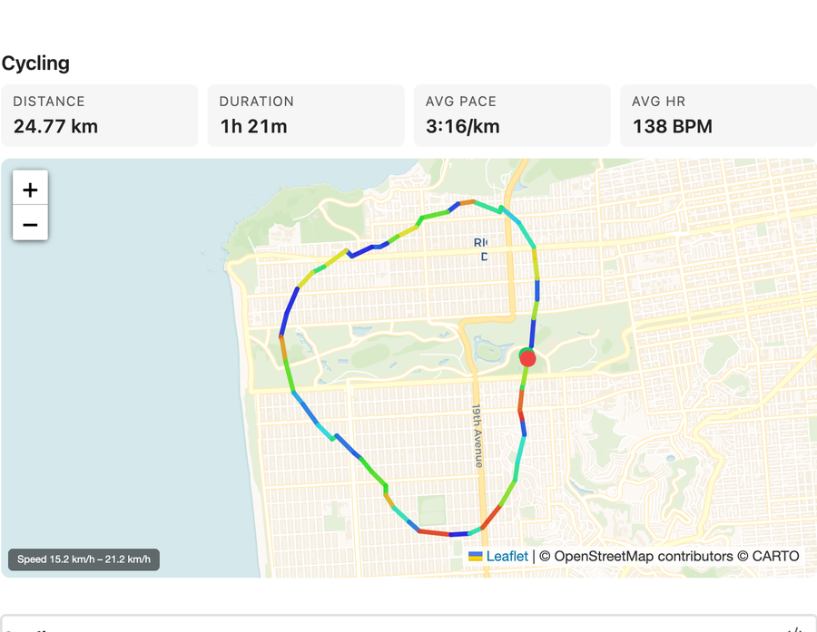</a></td>
<td><p><strong><code>workout-map</code></strong></p><p>GPS route map for one outdoor workout, colored by speed or heart rate.</p><p><strong>Extra arguments:</strong> <code>date</code>, <code>workout</code>, <code>colorBy</code>.</p></td>
</tr>
</table>

Detailed Health.md individual workout notes are discovered from `type: workout`, `metric: workouts`, or workout/healthmd tags. The plugin normalizes their frontmatter, heart-rate zones, laps, and splits for `workout-log`, `workout-heart-rate`, `workout-zones`, `workout-trends`, and the HTML `workout-intervals` table.

All canvas chart types support hover tooltips. Click behavior is configurable: keep the default click-to-pin tooltip behavior, open the source health data file for a point, or open the matching Daily Note. JSON and CSV source files open in a built-in Health.md read-only viewer inside Obsidian, so source navigation does not launch your OS default editor. Aggregate canvas regions that cover multiple dates, such as `weekday-average` bars, navigate to the latest matching date in the rendered range. The `intro-stats`, `summary-card`, `trend-tile`, `medication-overview`, individual `medication-*` section components, `workout-map`, and `workout-intervals` types are HTML/SVG/Leaflet renderers (no canvas tooltip layer) for sharper typography and interactive map rendering.

### Bundled examples

Starter dashboards live in the `examples/` folder — copy any of them into your vault to see the code blocks render:

- `examples/visualization-reference.md` — landing page for category-specific visualization references, shared arguments, the full type index, and copy/paste templates.
- `examples/apple-dashboard.md` — full Apple Health-style summary using the Apple-inspired visualizations (summary cards, activity rings, heart range, bar chart, sleep schedule, mood trend, weekday average, oxygen range, trend tiles).
- `examples/daily-dashboard.md` — single-day overview for daily notes.
- `examples/weekly-overview.md` — rolling week-at-a-glance across activity, heart, respiratory, sleep, mood, mobility, and workouts.
- `examples/sleep-analysis.md` — sleep-focused drill-down.

This repo also ships deterministic mock data in `examples/Health/` (one JSON file per day from 2025-11-19 through 2026-12-31) including activity, heart, vitals, sleep, workouts, and Health.md-style mood / State of Mind entries under `mindfulness.stateOfMindEntries`. When the default `Health/` folder is empty or missing, the plugin falls back to this bundled dataset so cloned examples render immediately. You can also set **Settings → Health.md Visualizations → Data folder** to `examples/Health` explicitly.

## Embedding charts in notes

A code block requires a `type` and accepts any of the optional config keys below. Each entry is a `key: value` line. Lines starting with `#` are comments.

````markdown
```health-viz
type: vitals-rings
width: 600
height: 400
```
````

### Common config keys

| Key | Type | Default | Description |
| --- | --- | --- | --- |
| `type` | string | *(required)* | Visualization type — see the gallery above. |
| `width` | number | from settings | Canvas width in pixels (chart shrinks to container width). |
| `height` | number | from settings | Canvas height in pixels. |
| `from` | date, datetime, dynamic variable, or frontmatter variable | — | Start of the data window (inclusive). |
| `to` | date, datetime, dynamic variable, or frontmatter variable | — | End of the data window (inclusive). |
| `last` | number | — | Number of calendar days back to include. |
| `clickAction` | `pin`, `source`, `daily` | from settings | Optional per-chart override for data point clicks: pin tooltip, open source data file, or open matching Daily Note. |

Individual visualization types may accept additional keys — start at `examples/visualization-reference.md` for links to every category-specific renderer argument, default, and accepted value.

## Filtering by date or date+time

Every visualization can be scoped to a custom window using `from`, `to`, and/or `last`. The filter is applied uniformly across all chart types — no need to learn per-chart syntax.

### Just a date

`from` and `to` accept ISO calendar dates:

````markdown
```health-viz
type: step-spiral
from: 2026-01-01
to: 2026-03-31
```
````

Open-ended ranges are fine too:

````markdown
```health-viz
type: oxygen-river
from: 2026-04-01
```
````

### Dynamic date variables

`from`, `to`, and chart-specific `date` fields can use built-in variables. They are resolved by Health.md when the chart renders, so they do not depend on Templater or Dataview.

````markdown
```health-viz
type: workout-log
from: {{monday:YYYY-MM-DD}}
to: {{today:YYYY-MM-DD}}
```
````

The format is optional and defaults to `YYYY-MM-DD`:

````markdown
```health-viz
type: step-spiral
from: {{month-start}}
to: {{month-end}}
```
````

Supported variables include `today`, `now`, `yesterday`, `tomorrow`, weekdays (`monday` through `sunday`, using the current Monday-start week), `week-start`, `week-end`, `month-start`, `month-end`, `year-start`, and `year-end`. Supported format tokens are `YYYY`, `YY`, `MM`, `M`, `DD`, `D`, `HH`, `H`, `mm`, `m`, `ss`, `s`, and `Z`.

### Frontmatter date variables

`from`, `to`, and chart-specific `date` fields can also reference top-level frontmatter properties from the current note using `{property-name}` or `${property-name}`. This is useful for weekly or monthly journal templates that should stay pinned to the journal's dates instead of moving with `last`.

````markdown
---
journal-start: 2026-06-01
journal-end: 2026-06-07
---

```health-viz
type: step-spiral
from: ${journal-start}
to: ${journal-end}
```
````

The frontmatter value must resolve to a supported date or datetime. Existing literal dates and `last` windows continue to work unchanged. If a variable is missing or resolves to an invalid value, the chart renders an inline error.

### Last N days

`last: N` is a rolling window of `N` calendar days ending today. `last: 1` is just today; `last: 30` is today plus the previous 29 days.

````markdown
```health-viz
type: heart-terrain
last: 30
```
````

Combine `last` with `to` to anchor the window on a specific day instead of today:

````markdown
```health-viz
type: vitals-rings
to: 2026-03-31
last: 7
```
````

This shows the 7-day window ending **March 31, 2026**.

### Sub-day windows with datetimes

`from` and `to` also accept ISO datetimes — `YYYY-MM-DDTHH:MM` or `YYYY-MM-DDTHH:MM:SS`, with an optional `Z` or `±HH:MM` timezone suffix. When you provide a time component, the plugin slices sub-day samples on the boundary days so the chart only shows data inside the requested window.

````markdown
```health-viz
type: heart-terrain
from: 2026-04-09T06:00:00
to: 2026-04-09T12:00:00
```
````

The chart above renders only morning heart rate samples for April 9, 2026.

A multi-day window with precise endpoints:

````markdown
```health-viz
type: oxygen-river
from: 2026-04-01T22:00:00
to: 2026-04-08T07:00:00
```
````

Includes April 1 from 10 PM onward, the full days April 2 through 7, and April 8 up to 7 AM.

You can mix datetimes with `last`:

````markdown
```health-viz
type: breathing-wave
to: 2026-04-09T12:00:00
last: 7
```
````

A 7-day calendar window ending April 9, with samples after noon on April 9 trimmed.

Explicit timezones work too:

````markdown
```health-viz
type: sleep-architecture
from: 2026-04-09T22:00:00-07:00
to: 2026-04-10T08:00:00-07:00
```
````

If you omit the timezone, the time is interpreted in your local timezone (matching JavaScript's `Date.parse` semantics).

### Day-level aggregates are recomputed

When a sub-day window slices a boundary day's samples, day-level fields like `averageHeartRate`, `bloodOxygenAvg`, `totalDuration`, `deepSleep`, `bedtime`, etc. are **automatically recomputed from the sliced samples**. This means the stats shown alongside your charts (in `intro-stats`, sleep tooltips, vitals rings, and other panels) reflect the requested time window — not the full day.

The fields that are recomputed:

- **Heart**: `averageHeartRate`, `heartRateMin`, `heartRateMax`, `hrv`
- **Vitals**: `bloodOxygenAvg`/`Min`/`Max` (and the legacy `bloodOxygenPercent`), `respiratoryRateAvg`/`Min`/`Max` (and legacy `respiratoryRate`)
- **Sleep**: `totalDuration` (deep + REM + core), `deepSleep`, `remSleep`, `coreSleep`, `awakeTime`, `bedtime`, `wakeTime`, plus all formatted-string variants
- **Workouts**: filtered by `startTime`

A guard ensures aggregates aren't clobbered for days that were parsed from daily summaries without per-sample data — those days pass through unchanged.

#### Limitation: activity totals

Apple Health exports `activity.steps`, `activity.activeCalories`, `activity.exerciseMinutes`, `activity.flightsClimbed`, `activity.standHours`, `activity.basalEnergyBurned`, and `mobility.*` as **daily totals only**, with no underlying sub-day samples. There is no truthful way to slice those numbers for a partial day, so they pass through unchanged on boundary days. This affects the step ring in `vitals-rings`, the totals in `step-spiral`, and any walking/mobility metrics on a boundary day. Heart-rate–derived fields inside the same charts *are* recomputed correctly.

### Validation

The plugin validates the date range up front and renders an inline error if something is off:

- `Invalid "from" value: ... Use YYYY-MM-DD or YYYY-MM-DDTHH:MM[:SS].`
- `Unknown dynamic date variable "..."...`
- `Missing frontmatter variable "journal-start" for "from"...`
- `Invalid "last": ... Use a positive number of days.`
- `"from" (...) is after "to" (...).`
- `No health data in range (...).` — when the window is valid but produces an empty result.

## Daily-note tip

Add a `health-viz` block to your daily-note template (Templates or Templater plugin) and have a moving "last N days" view automatically appear in every new daily note:

````markdown
```health-viz
type: heart-terrain
last: 7
```
````

Because `last` is anchored on today by default, each new daily note shows the most recent 7 days at the moment you open it. The plugin's data cache invalidates whenever files in your data folder change, so the chart always reflects the latest export.

## Data format reference

The plugin auto-detects the data format from the file extension. Each file should represent **one day** of health data and live inside your configured data folder.

- `.json` — A `HealthDay` object (see `src/types.ts` for the full shape).
- `.csv` — Health.md row exports (`Date,Category,Metric,Value,Unit[,Timestamp]`). The parser accepts both historical plugin labels and current iOS/Android labels such as `Min Heart Rate`, `Cardio Fitness (VO2 Max)`, `Respiratory Rate Avg`, and granular sample rows. See `src/parsers/csv-parser.ts`.
- `.md` — A markdown file with YAML frontmatter that uses fields like `average_heart_rate`, `sleep_deep_hours`, `steps`, schema v2 medication fields (`medication_count`, `medication_details`, `medication_dose_events`), etc. Optional Health.md granular tables (`Time | BPM`, `Time | SpO2`, `Start | End | Stage`, …) are parsed when present. Frontmatter is recommended for aggregate metrics; markdown without frontmatter needs an ISO date in the title/body. See `src/parsers/markdown-parser.ts`. This format is compatible with Obsidian Bases.

The top-level `date` field on each day must be a `YYYY-MM-DD` ISO date — the date filter does fast lexicographic comparisons against this field.

## Development

```bash
npm install
npm run dev      # esbuild watch mode
npm run build    # production build
```

Source layout:

- `src/main.ts` — plugin entry point and settings tab
- `src/renderer.ts` — code-block processor, config parsing, date range filtering, and aggregate recomputation
- `src/data-loader.ts` — vault-aware data loader with cache invalidation
- `src/parsers/` — JSON, CSV, and Markdown parsers
- `src/visualizations/` — one file per chart type, plus `intro-stats.ts` (HTML)
- `src/canvas-utils.ts` — shared canvas helpers and color palettes
- `src/types.ts` — `HealthDay`, `VizConfig`, `HitRegion`, render-fn signatures

## License

MIT — see `package.json`.
